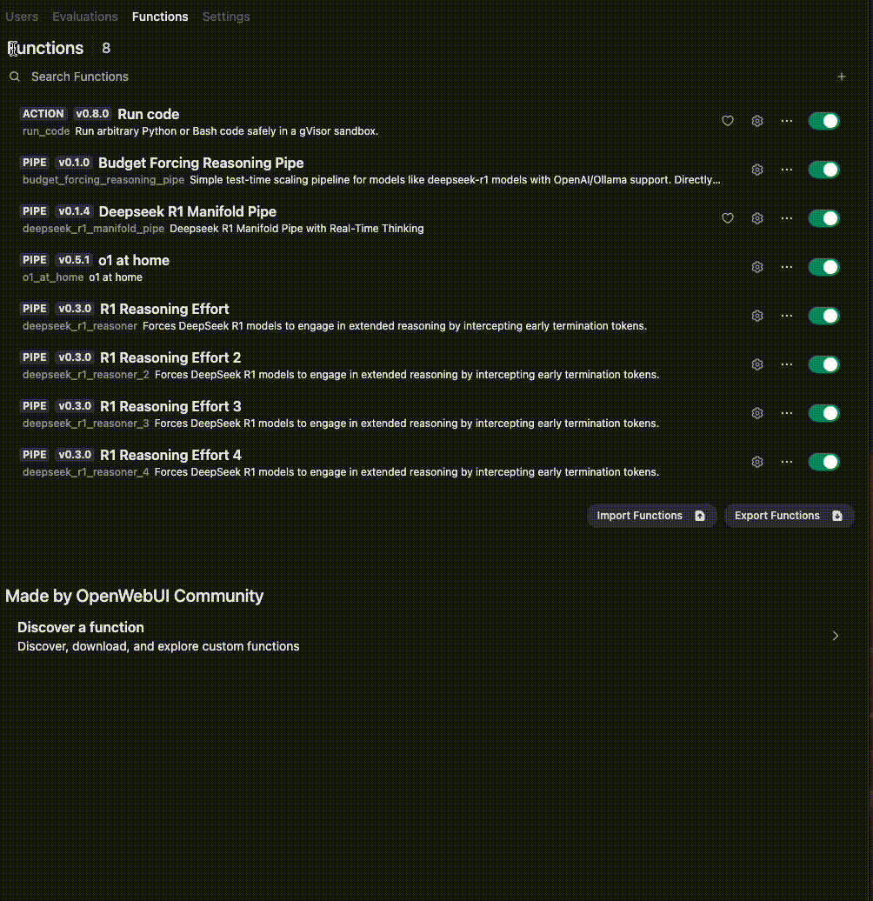

# Budget Forcing Reasoning Pipe

## Overview
**Budget Forcing Reasoning Pipe** is a lightweight, API reasoning pipeline built within [open-webui](https://github.com/open-webui/open-webui). This pipe integrates Ollama APIs and leverages a simple wait-based technique to control test-time compute. By enforcing configurable lower and upper bounds on the number of "thinking" tokens, it ensures that the model generates sufficient reasoning before finalizing its answer while preventing excessive token generation.

Based on the test-time scaling approach from the [s1 paper](https://arxiv.org/pdf/2501.19393), this pipeline guarantees that a minimum number of tokens is produced (by appending "Wait" if needed) and forcefully terminates the reasoning process once an upper threshold is reached.

## Features
- **Multi-API Support**: Seamlessly switch between OpenAI and Ollama APIs.
- **Budget Forcing**: Control test-time compute with simple lower and upper token bounds.
- **Simple Wait Technique**: Automatically appends "Wait" if the model attempts to finish too early, ensuring adequate reasoning.
- **Configurable Token Bounds**: Easily adjust `MIN_THINKING_TOKENS` and `MAX_THINKING_TOKENS` to suit your needs.
- **Streamlined Design**: Eliminates iterative reasoning efforts for a more focused, efficient pipeline.
- **Robust Logging & Error Handling**: Detailed logs capture API errors and other issues.

## Usage

### Basic Example
The core pipeline is implemented in the `Pipe` class. It processes input messages, communicates with the chosen API, and applies budget forcing to manage the reasoning phase.

#### Configuration
After setting up [open-webui](https://github.com/open-webui/open-webui), configure the `Valves` parameters in the pipe as follows:
- **`USE_OPENAI_REASONING`**: Set to `true` to use the OpenAI API or `false` for Ollama.
- **`REASONING_MODEL`**: Specify the model identifier (e.g., `"deepseek-r1:8b"`).
- **`MIN_THINKING_TOKENS`**: The minimum number of tokens that must be generated before termination is allowed.
- **`MAX_THINKING_TOKENS`**: The maximum number of tokens to generate before forcefully ending the reasoning phase.
